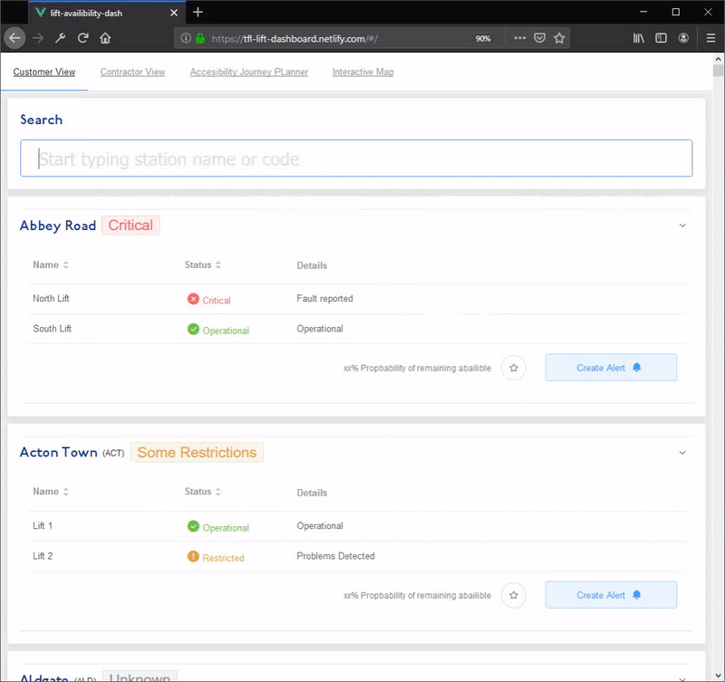

# TFL Lift Dash

**Live Demo:** https://tfl-lift-dash.as93.net 

**The Problem:** When faults on lifts on the TFL network occur, it can take a short while for it to be detected and reported, even longer on unmanned DLR stations. 

**Our Solution:** We used computer vision on real-time CTTV footage to detect when issues on the escalators and lifts occurred, and then display the results on a dash-board. We thought this could be particularly useful for customers with reduced mobility, who are reliant on the lifts being operational. It could also be useful for the maintainers, to understand which lifts are out of service and have the highest demand at present.

**🏆 Won 1st prize at [Infra-hack 2019](https://hackpartners.com/hackathons/). Also won Network Rail, and TFL Award. 🏆**

This is the dashboard component for our hackathon project. It is now using fake data, since we don't have proper access to all the tfl CTTV cameras in real-time :(

### Screenshots

#### Detecting people using the elevators and lifts

### Building Locally:

 - **Clone**: `git clone git@github.com:Lissy93/tfl-lift-availability-dash.git && cd tfl-lift-availability-dash`
 - **Project setup**: `yarn install`
 - **Compiles and hot-reloads for development**: `yarn serve`
 - **Compiles and minifies for production**: `yarn build`
 - **Lints and fixes files**: `yarn lint`
 - **Run the end-to-end tests**: `yarn run test`

## The MIT License (MIT)
### Copyright (c) Alicia Sykes <alicia@aliciasykes.com> 

Permission is hereby granted, free of charge, to any person obtaining a copy 
of this software and associated documentation files (the "Software"), to deal 
in the Software without restriction, including without limitation the rights 
to use, copy, modify, merge, publish, distribute, sub-license, and/or sell 
copies of the Software, and to permit persons to whom the Software is furnished 
to do so, subject to the following conditions:

The above copyright notice and this permission notice shall be included install 
copies or substantial portions of the Software.

THE SOFTWARE IS PROVIDED "AS IS", WITHOUT WARRANTY OF ANY KIND, EXPRESS OR 
IMPLIED, INCLUDING BUT NOT LIMITED TO THE WARRANTIES OF MERCHANT ABILITY, 
FITNESS FOR A PARTICULAR PURPOSE AND NON INFRINGEMENT. IN NO EVENT SHALL 
THE AUTHORS OR COPYRIGHT HOLDERS BE LIABLE FOR ANY CLAIM, DAMAGES OR OTHER 
LIABILITY, WHETHER IN AN ACTION OF CONTRACT, TORT OR OTHERWISE, ARISING FROM, 
OUT OF OR IN CONNECTION WITH THE SOFTWARE OR THE USE OR OTHER DEALINGS IN THE SOFTWARE.